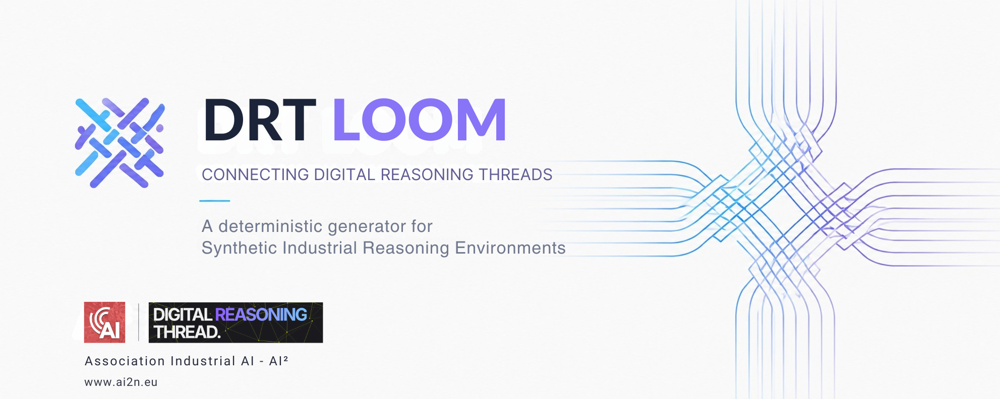
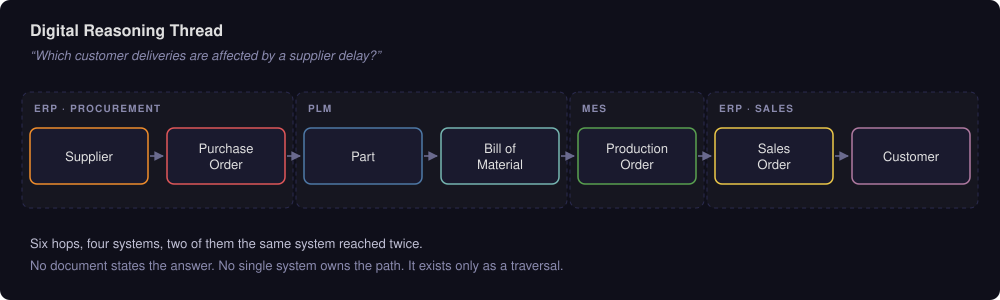
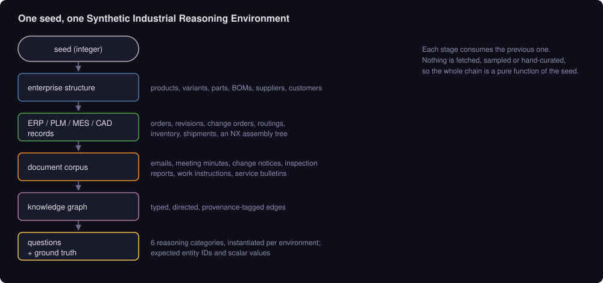
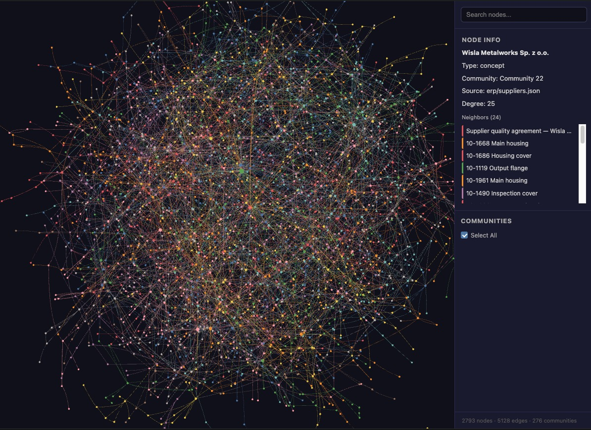
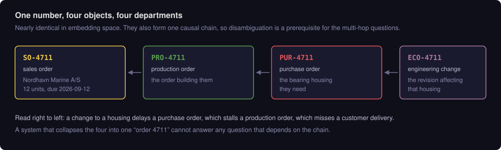

# DRT Loom

DRT Loom generates deterministic Synthetic Industrial Reasoning Environments. Each
environment models a complete industrial enterprise spanning ERP, PLM, MES, CAD and
enterprise documents. From that model the generator derives structured records, a
knowledge graph, benchmark questions and evaluation artifacts.

**The problem.** Industrial AI systems are hard to evaluate. Real ERP, PLM and MES
extracts carry commercial and personal data and are rarely publishable. Public
corpora are single-domain — maintenance logs, technical documents, sensor traces —
and measure document retrieval. The questions that matter in an enterprise are
answered by joining records across systems, and no public corpus measures that.

**The unit of work.** Answering *"which customer deliveries are affected by a
supplier delay?"* means traversing supplier → purchase order → part → bill of
material → production order → sales order → customer. ERP, PLM and MES each hold
one segment. No system holds the join and no document records it. That chain is a
**Digital Reasoning Thread**.

**The approach.** Generate the enterprise instead of collecting it. Because the
environment is constructed, every relationship in it is known exactly, so ground
truth for a traversal can be derived rather than annotated. Because generation is a
pure function of an integer seed, the same seed reproduces the same environment
byte-for-byte on any machine, and a new seed produces a new environment with the
same schema and the same reasoning categories.

The generator is the primary artifact. The knowledge graph, the benchmark questions
and the committed reference environment are all derived from it.

DRT Loom is the reference implementation of the Digital Reasoning Thread concept,
developed under AI², the Association Industrial AI.


---

## Quick start

```bash
git clone https://github.com/association-industrial-ai/drt-loom.git
cd drt-loom
npm install
npm run gen
```

Node 20+. No network access, no API keys, no database. The run takes about 30 ms.

```
Generating Kestrel Drive Systems dataset (seed 20260728, today 2026-07-28)…

  entities   2793
  relations  5309
  documents  204
  NX components 27
  gold questions 18

  Act 2 — orders at risk: 16, exposure 2739771.54 EUR
  Act 3 — blockers: 30-1177/eco_effectivity, 10-1668/unreleased_revision, 10-1654/no_approved_supplier

✓ wrote data/generated in 33 ms
```

### What you get

```
data/generated/
├── dataset.json     2.1 MB    2,793 entities and 5,309 typed relations
├── gold.json         12 KB    18 questions with expected IDs and values
├── documents/       204 Markdown files
└── nx/                1 NX assembly export
```

Entities record the source file they would have originated from. Relations are
typed and carry a provenance tag.

```jsonc
// dataset.json → entities[]
{
  "id": "SUP-001",
  "type": "Supplier",
  "label": "Nordwerk Guss GmbH",
  "sourceFile": "erp/suppliers.json",
  "sourceLocation": "L1",
  "attrs": { "country": "DE", "onTimeDeliveryRate": 0.817, "riskFlag": true }
}

// dataset.json → relations[]
{
  "source": "PART-10-1798",
  "target": "SUP-001",
  "relation": "approved_supplier",
  "confidence": "EXTRACTED",
  "sourceFile": "erp/approved_vendor_list.json",
  "attrs": { "framework": "frame contract" }
}
```

Nine relations are tagged `AMBIGUOUS`, all of them CAD-to-ERP joins that a real
integration could not make cleanly:

```jsonc
{
  "source": "PART-20-1081",
  "target": "CADC-20-1081",
  "relation": "modeled_as",
  "confidence": "AMBIGUOUS",
  "attrs": { "via": "name similarity — DB_PART_NO missing in CAD" }
}
```

Each question in `gold.json` carries the entity IDs a correct answer should cite
and the scalar values it should state.

```jsonc
{
  "id": "Q-MH-01",
  "category": "multi_hop",
  "question": "Nordwerk Guss GmbH has told us bearing housing 30-1177 will slip by
               three weeks. Which customer deliveries due before the end of November
               are at risk, and what is the total value exposed?",
  "expectedIds": ["SO-4711", "SO-4716", "SO-4720", "…"],
  "expectedValues": { "ordersAtRisk": 16, "customersAffected": 11, "exposureEur": 2739771.54 },
  "reference": "Traverse: part 30-1177 → BOM parents → variants (3) → sales order
                lines → open sales orders (16) → customers (11)."
}
```

Documents are Markdown, and some facts appear only here:

```markdown
<!-- DOC-0004 · eco_notice · 2026-06-18 -->

# Engineering change notice ECO-4711

**Title:** Bearing housing 30-1177: increase bearing seat tolerance, rev B → C
**Effective from:** 2026-09-15
**Disposition:** use-up existing stock, then switch

## Reason

Field returns from three marine installations showed fretting corrosion on the
bearing seat.
```

### Build the knowledge graph

Optional. Evaluating document retrieval alone needs only the corpus above.

```bash
npm run graph
```

```
Extracted 2793 nodes / 5309 edges from Kestrel Drive Systems
  note: 181 duplicate edge(s) collapsed (same pair, same relation)
Built directed graph: 2793 nodes, 5128 edges, 274 communities

  provenance: AMBIGUOUS 9, EXTRACTED 5119
  wrote data/graph/graph.json (2.55 MB), graph.html, graph.cypher
```

The first run creates a Python virtualenv and installs
[Graphify](https://github.com/Graphify-Labs/graphify); later runs take seconds.
Open `data/graph/graph.html` to search nodes, inspect neighbours and filter by
community. `graph.cypher` loads the same graph into a graph database.

Node and relation counts are reproducible. The community count is not — Leiden
clustering is re-run on each build and the committed graph was built at 272.

### Score an answer

`src/score/score.ts` has no dependencies and does not require an LLM judge.

```ts
import { readFileSync } from "node:fs";
import { enrichCitations, scoreCitations, scoreValues } from "./src/score/score";

const gold = JSON.parse(readFileSync("data/generated/gold.json", "utf8"));
const q = gold.find((g) => g.id === "Q-MH-01");

// whatever the system under evaluation produced
const answer =
  "16 orders are at risk, exposing 2,739,771.54 EUR across 11 customers, " +
  "including Nordhavn Marine A/S.";
const citedIds = ["SO-4711", "SO-4716"];

scoreCitations(enrichCitations(citedIds, answer), q.expectedIds);
// → { precision: 1, recall: 0.125, f1: 0.22, hit: 2, expected: 16, cited: 2 }

scoreValues(answer, q.expectedValues);
// → { matched: 3, total: 3, missing: [] }
```

`enrichCitations` reads `data/generated/dataset.json` relative to the working
directory, and resolves entity names in the answer text back to IDs — an answer
naming "Nordhavn Marine A/S" gets credit for `CUST-001`.

### Generate a different environment

```bash
SEED=7 OUT_DIR=data/generated-seed7 npm run gen
```

Same schema, same 18 questions, different world: 2,832 entities and 5,404 relations
instead of 2,793 and 5,309, and Q-MH-01 resolves to 6 orders worth €723,681.01
instead of 16 worth €2,739,771.54.

### Check determinism

```bash
OUT_DIR=/tmp/a npm run gen
OUT_DIR=/tmp/b npm run gen
diff -r /tmp/a /tmp/b && echo identical
```

### Configuration and layout

`SEED` (default `20260728`) and `OUT_DIR` (relative to cwd, or absolute) control the
generator. `BENCH_ROOT` points the extractor at a different tree.

```
src/generate/     the generator — deterministic, no network
src/score/        citation F1 and scalar matching
src/types.ts      the Dataset type every artifact conforms to
extractor/        Python: Graphify build of dataset.json into a knowledge graph
data/generated/   dataset.json, gold.json, documents, NX export   (reference)
data/graph/       graph.json                                      (reference)
docs/             SCHEMA.md, QUESTIONS.md
```

### Next

- [What the questions test](#reasoning-categories) and the full list in [docs/QUESTIONS.md](docs/QUESTIONS.md)
- [Entity and relation schema](docs/SCHEMA.md)
- [Adding your own domain](#appendix-adding-a-domain)
- [Known defects in the ground truth](KNOWN-ISSUES.md) — read before quoting a number

---

## Context

```
AI²                                          Association Industrial AI
└── Digital Reasoning Thread (DRT)           the unit of reasoning
    └── DRT Loom                             this repository
        ├── Synthetic Industrial Reasoning Environment Generator
        ├── Knowledge Graph Generation
        ├── Benchmark Question Generation
        ├── Evaluation / Scoring
        └── Reference Worlds
```

| | |
|---|---|
| Initiative | [Association Industrial AI (AI²)](https://www.ai2n.eu) |
| Concept | [digital-reasoning-thread.com](https://digital-reasoning-thread.com/) · [vlarichev/digital-reasoning-thread](https://github.com/vlarichev/digital-reasoning-thread/) |
| Implementation | this repository |

---

## Digital Reasoning Threads

A Digital Thread connects engineering and manufacturing data across the product
lifecycle. A Digital Reasoning Thread is the chain of relationships an agent
traverses across enterprise systems to answer a business question.



Enterprise knowledge is distributed across disconnected systems with different
identifiers, different granularity and different owners. A corpus drawn from one
system reproduces neither that distribution nor the joins across it. A generated
environment reproduces both, and it is publishable.

The reference environment contains 5,309 typed relations across 25 relation types.
Paths through them are the unit of evaluation used throughout this repository.

---

## What an environment contains

| Domain | Modelled as |
|---|---|
| ERP | sales orders, purchase orders, inventory lots, shipments |
| PLM | products, variants, parts, revisions, multi-level bills of material |
| MES | production orders, routings, work centers |
| CAD | an NX assembly tree with drawings and instance-name conventions |
| Documents | emails, meeting minutes, change notices, inspection reports, work instructions, service bulletins |
| Suppliers | supply base, approved-supplier relationships, purchasing history |
| Customers | commercial relationships and delivery commitments |
| Engineering changes | change orders with effectivity dates and affected parts |
| Production & logistics | order fulfilment, shipment and delivery chains |

All domains are generated together from one enterprise model, so cross-domain
relationships are part of the model rather than annotations added over it.

---

## Extending to other domains

The reference environment models discrete manufacturing. In that landscape the same
physical part appears as a PLM object, an ERP procurement item, an MES consumption
record and a CAD component, each system holding a different identifier and a
different fragment of the record. Cross-domain reasoning follows from the domain
itself.

Other industrial domains have the same structure. Candidates:

- Industrial Automation — PLC projects, control logic, alarms, HMI, tags, ISA-95 assets
- Process Industries
- Energy systems
- Building Automation
- Maintenance & Asset Management
- Quality Management
- OT / SCADA environments
- Robotics
- Digital Twins

The intended split between a domain and the framework:

| A domain supplies | The framework supplies |
|---|---|
| Domain model — entity and relation types | Deterministic seeding and reproducibility |
| Environment generator | The `Dataset` contract every artifact conforms to |
| Document families and narrative style | Knowledge graph construction |
| Domain-specific reasoning obstacles | Digital Reasoning Thread structure |
| Question templates | Ground-truth derivation |
| | Citation and scalar scoring, execution metrics |

An OT thread — alarm → tag → control loop → equipment module → maintenance order →
spare part → supplier — uses different vocabulary and the same shape as the
manufacturing thread above. Both are scored by the same code.

A step-by-step guide: [Appendix: adding a domain](#appendix-adding-a-domain).

### Current state of the split

Three components are already domain-independent.
[`src/generate/rng.ts`](src/generate/rng.ts) is a seeded PRNG.
[`extractor/extract.py`](extractor/extract.py) maps any entity type into the graph
generically. [`src/score/score.ts`](src/score/score.ts) scores against the
`Dataset` contract, with one hardcoded entity-type filter used for name enrichment.

Two are not. [`src/types.ts`](src/types.ts) declares the manufacturing node and
relation types as closed unions, and `src/generate/` is a single pipeline rather
than a registered domain module. Separating them behind a stable contract is a
design goal and is item 7 on the [roadmap](#roadmap). Until then, adding a domain
means editing the generator.

---

## Pipeline



Each stage is computed from the seed and the output of the previous stage. No stage
reads external data. Ground truth is the one stage not yet fully derived from the
environment; see [Status](#status).

### Seeds

Comparing the reference environment against seed 7: schema, question set and
category structure are identical. 7 of the 18 answers have different scalar values
and 9 have different expected entity sets. The assembly tree grows from 27
components to 30.

Re-rolling the seed is not a contamination guarantee. A model trained on the
reference environment will still recognise it, and domain vocabulary transfers
across seeds. What re-rolling provides is narrower: memorising one static corpus
stops being a shortcut, and a large gap between a system's reference-seed score and
its fresh-seed score is measurable evidence of memorisation. Report both.

---

## Artifacts



`dataset.json`, `gold.json`, `documents/` and `nx/` are committed for the reference
environment, as is `data/graph/graph.json`. The explorer and the Cypher export are
~4 MB of derived view and are rebuilt by `npm run graph`.

Every entity records the source file and location it would have originated from.
Every graph edge carries a provenance tag of `EXTRACTED`, `INFERRED` or
`AMBIGUOUS`. Citation scoring uses the source file; the provenance tags let a
system report uncertainty about its own inputs.

---

## Evaluation

The benchmark is one application of the generated environments. It addresses one
question:

> Where is a strong hybrid retrieval system sufficient, and where does explicit
> relationship traversal become necessary?

Because environments are reproducible and their relationships are known, one
question set can evaluate architectures that work in different ways: hybrid RAG,
GraphRAG, tool-using agents, planning agents, multi-agent systems.

### Reasoning categories

18 question templates, instantiated against each generated environment:

| Category | n | What it probes |
|---|---:|---|
| `disambiguation` | 2 | Overloaded identifiers across business object types |
| `multi_hop` | 4 | Threads spanning ERP, PLM, MES and CAD, including CAD-to-ERP resolution |
| `aggregation` | 3 | Counts and sums requiring a complete matching set |
| `absence` | 3 | Missing relationships — facts no document states |
| `lookup` | 3 | Single-record retrieval, the control case |
| `narrative` | 3 | Prose-only answers, where retrieval should win |

Full list with per-category rationale and reference answers:
[docs/QUESTIONS.md](docs/QUESTIONS.md).

Question wording is currently identical across seeds, because the scripted spine of
the environment (the `4711` object family) uses fixed identifiers. What varies per
seed is the environment the question resolves against, and therefore the answer.
Parameterising the spine per seed is item 3 on the [roadmap](#roadmap).

### What the categories separate

**Document retrieval.** Some facts exist only in prose: an exception recorded in a
change notice, a failure mode visible only across a dozen inspection reports.
Structured queries cannot reach them.

**Relationship reasoning.** Some facts exist only as paths. "Which customers are
affected if this supplier slips" is six hops across four systems. Similarity
ranking is the wrong operation for a join, so top-k retrieval cannot reliably
perform exhaustive cross-system joins, counts or absence queries.

**Agent execution.** A system can identify all 19 qualifying change orders and then
fail to complete the count. Tool-call counts, turn counts and latency are recorded
alongside correctness, so execution failures are distinguishable from reasoning
failures.

**Evaluation integrity.** Incorrect ground truth is worse than none, because it is
confidently wrong. Known defects are documented in
[KNOWN-ISSUES.md](KNOWN-ISSUES.md) rather than corrected silently.

### One category favours retrieval

The `narrative` category is answerable only from prose, and a knowledge graph
contributes nothing to it. This is intentional. If one architecture wins every
category, the benchmark is measuring its own construction, and the multi-hop result
is interpretable only if the retrieval baseline wins somewhere.

The same applies to baseline construction. Records must be serialised into readable
prose before indexing. Embedding raw table rows produces a weak baseline, and
comparisons against it are uninformative.

### Scoring

Correctness does not require an LLM judge, though a judge is useful on top for
answer quality. The call sequence is in [Score an answer](#score-an-answer);
[`src/score/score.ts`](src/score/score.ts) is dependency-free.

Two behaviours matter when aggregating. `enrichCitations` resolves entity names back
to IDs, because matching raw ID regexes would penalise correct answers across every
system equally. `scoreCitations` returns `NaN` where the gold answer contains no
entity IDs, so those questions are excluded from the average instead of scoring a
free 1.0.

Report latency, token counts and tool-call counts alongside accuracy. Accuracy alone
does not distinguish a system that is right and slow from one that is right and
cheap.

---

## Reasoning obstacles

Four properties are staged deliberately, each modelled on a failure mode that occurs
in real enterprise landscapes.

**Overloaded identifiers.** Four unrelated business objects share the number 4711:



The four are nearly identical in embedding space and belong to four departments.
They also form one causal chain, so disambiguation is a prerequisite for the
multi-hop questions rather than a separate string-matching exercise.

**Absence as a first-class case.** "Which purchased parts have no approved supplier"
resolves to a missing edge. No document states it, so retrieval cannot find it.
Three questions use this shape; it is common in quality and compliance work and
invisible to search.

**CAD does not join cleanly.** The NX assembly tree maps to the ERP part master
through instance-name conventions rather than part numbers. 9 of the resulting edges
are tagged `AMBIGUOUS` because the source file lacks a usable attribute.

**Provenance throughout.** Every edge carries `EXTRACTED`, `INFERRED` or
`AMBIGUOUS`, and every entity keeps a source file and location, so a path can be
audited hop by hop.

---

## Reference environment

`data/generated` holds one environment, built from seed `20260728`. It is committed
so that results are comparable across users, and serves as the worked example of a
complete domain: entity types, reasoning obstacles and scored questions.

| | |
|---|---|
| Business records | 2,793 entities across 20 types |
| Relations | 5,309 typed relations across 25 types |
| Documents | 204 documents, 17,649 words, 8 families |
| Knowledge graph | 2,793 nodes · 5,128 edges · 272 communities |
| CAD export | 1 NX assembly tree, 27 components, 22 distinct part numbers |
| Questions | 18 across 6 categories |

The graph holds fewer edges than the dataset holds relations because Graphify
collapses duplicate (source, target, relation) triples. The community count is a
property of the clustering step rather than of the environment; entity and relation
counts are the reproducible figures. All of these describe one environment.

The modelled company is Kestrel Drive Systems, a fictional manufacturer of modular
helical-bevel gear units: variant-configured products, multi-level bills of
material, a supply base, engineering changes with effectivity dates, production
orders, shipments and a CAD assembly tree.

Entity and relation types, graph format and the NX schema:
[docs/SCHEMA.md](docs/SCHEMA.md).

---

## Status

Version 0.1.0.

**Stable.** The generator is deterministic and verified byte-identical across clean
runs. The schema and graph build are stable. Provenance tagging works.

**Incomplete.** Ground truth is partly derived from the generated environment and
partly specified by hand in `src/generate/gold.ts`. Where the two disagree the
hand-written value wins and nothing checks it. One gold answer is confirmed wrong
and contradicts another. 4 of 18 have been independently verified. Read
[KNOWN-ISSUES.md](KNOWN-ISSUES.md) before publishing any number measured here.

**Not implemented.** No reference baselines. The suite has not been run end to end
against a hybrid-retrieval system and a graph-augmented system, so this repository
quotes no comparative results.

### Roadmap

1. Derive every gold answer from the built graph, using the same query layer a
   system under evaluation would use. Keep hand-written text only as human-readable
   `reference` prose.
2. Add sanity gates that fail the build when a derived answer stops holding at a
   different seed. The existing gate asserts a hardcoded count and is the direct
   cause of the known defect.
3. Parameterise the scripted spine per seed so question wording varies with the
   environment, not only the answers.
4. Publish reference baselines across several seeds, with latency and token cost.
5. Expand the template set.
6. Add maintenance, quality and cost to the manufacturing domain so paths span more
   of the enterprise.
7. Separate the domain model from the framework: move the closed node and relation
   unions in `src/types.ts` behind a registered domain module, and remove the
   hardcoded entity-type filter in `src/score/score.ts`.

Contributions that break an existing gold answer are more useful than contributions
that add questions.

---

## Appendix: adding a domain

This documents the current code. There is no plugin registry, so adding a domain
means editing the generator. All file paths and signatures below are real.

The worked example adds an Industrial Automation / OT layer to the existing
environment: an alarm on a process tag, traced through control logic and equipment
to a maintenance order, a spare part and its supplier.

```
Alarm → Tag → Control Loop → Equipment Module → Maintenance Order → Part → Supplier
```

The example extends the existing environment rather than starting a new one. The
thread terminates in the `Part` and `Supplier` entities the manufacturing domain
already owns, so answering an OT question requires crossing into ERP.

### 1. Declare the vocabulary

Node and relation types are closed unions in [`src/types.ts`](src/types.ts).
TypeScript then flags every unhandled case.

```ts
// src/types.ts
export type NodeType =
  | "Customer"
  // … existing manufacturing types …
  | "Shipment"
  /* automation */
  | "EquipmentModule"
  | "ControlLoop"
  | "Tag"
  | "Alarm"
  | "MaintenanceOrder";

export type RelationType =
  // … existing relations …
  /* automation */
  | "part_of_line"    // EquipmentModule  -> EquipmentModule
  | "controls"        // ControlLoop      -> EquipmentModule
  | "reads_tag"       // ControlLoop      -> Tag
  | "raised_on"       // Alarm            -> Tag
  | "triggered"       // Alarm            -> MaintenanceOrder
  | "consumes_spare"; // MaintenanceOrder -> Part      ← crosses into ERP
```

Design around one constraint before writing code: the graph build rejects two
different relation types between the same ordered pair of entities. Graphify returns
a `DiGraph`, so parallel edges collapse and a fact is lost;
[`extractor/extract.py`](extractor/extract.py) fails the build instead. Duplicate
edges of the same type are collapsed with a note.

### 2. Write the generator

A domain module is a function over the shared [`Builder`](src/generate/builder.ts)
and a seeded [`Rng`](src/generate/rng.ts). Create `src/generate/automation.ts`:

```ts
import type { Builder } from "./builder";
import type { MasterData } from "./master-data";
import { chance, dateBetween, int, pick, round, seq, type Rng } from "./rng";

export interface AutomationIndex {
  moduleIds: string[];
  tagIds: string[];
  alarmIds: string[];
}

export function buildAutomation(b: Builder, md: MasterData, rng: Rng): AutomationIndex {
  const ix: AutomationIndex = { moduleIds: [], tagIds: [], alarmIds: [] };

  for (let i = 1; i <= 12; i++) {
    const modId = `EQM-${seq(i, 3)}`;
    b.entity(modId, "EquipmentModule", `Equipment module ${seq(i, 3)}`, "ot/isa95_assets.json", {
      isa95Level: "unit",
      area: pick(rng, ["Machining", "Assembly", "Test", "Paint"]),
      commissioned: dateBetween(rng, "2018-01-01", "2025-06-01"),
    });
    ix.moduleIds.push(modId);

    const tagId = `TAG-${seq(i, 4)}`;
    b.entity(tagId, "Tag", `${modId}.SpindleTemp`, "ot/tag_dictionary.csv", {
      address: `DB${int(rng, 10, 99)}.DBD${int(rng, 0, 240)}`,
      unit: "degC",
      highLimit: round(70 + rng() * 20, 1),
    });
    ix.tagIds.push(tagId);

    const loopId = `LOOP-${seq(i, 3)}`;
    b.entity(loopId, "ControlLoop", `Thermal control ${seq(i, 3)}`, "ot/plc_program.json", {
      block: `FB${int(rng, 100, 999)}`,
      strategy: "PID",
    });

    b.rel(loopId, "controls", modId, { sourceFile: "ot/plc_program.json" });
    b.rel(loopId, "reads_tag", tagId, { sourceFile: "ot/plc_program.json" });
  }

  return ix;
}
```

Three rules the `Builder` enforces or assumes:

- **Determinism.** Draw every random choice from `rng`. `Math.random()`,
  `Date.now()` and `new Date()` break byte-identical rebuilds. Use the `TODAY`
  constant and the date helpers in `rng.ts`.
- **Stable unique ids.** `b.entity()` throws if an id repeats, and also if the id
  slugifies to its own source file's stem, which Graphify would silently rewrite.
  This is why source files are named `tag_dictionary.csv` rather than `tag.csv`.
- **`sourceFile` is a citation.** It is what a system under evaluation quotes back,
  and `extract.py` requires it on edges as well as nodes. `b.rel()` inherits it from
  the source entity if omitted.

### 3. Cross into an existing domain

A domain that links only to itself adds entities without adding reasoning paths. The
edge into the manufacturing world is what creates a thread:

```ts
// still in buildAutomation()
for (const [i, tagId] of ix.tagIds.entries()) {
  if (!chance(rng, 0.4)) continue;

  const alarmId = `ALM-${seq(i + 1, 4)}`;
  b.entity(alarmId, "Alarm", `High temperature — ${b.get(tagId).label}`, "ot/alarm_log.csv", {
    severity: pick(rng, ["warning", "high", "critical"]),
    raisedAt: dateBetween(rng, "2026-04-01", "2026-07-20"),
    acknowledged: chance(rng, 0.7),
  });
  b.rel(alarmId, "raised_on", tagId, { sourceFile: "ot/alarm_log.csv" });
  ix.alarmIds.push(alarmId);

  const moId = `MO-${seq(i + 1, 4)}`;
  b.entity(moId, "MaintenanceOrder", `Maintenance order ${seq(i + 1, 4)}`, "eam/maintenance_orders.json", {
    status: pick(rng, ["open", "in_progress", "closed"]),
    createdAt: dateBetween(rng, "2026-04-01", "2026-07-25"),
  });
  b.rel(alarmId, "triggered", moId, { sourceFile: "eam/maintenance_orders.json" });

  // the cross-domain hop: an OT alarm now reaches an ERP part and its supplier
  const spare = pick(rng, md.partIds);
  b.rel(moId, "consumes_spare", spare, {
    sourceFile: "eam/maintenance_orders.json",
    confidence: "INFERRED", // matched by description, not by part number
  });
}
```

Tag an edge `INFERRED` or `AMBIGUOUS` wherever the join would be uncertain in a real
integration. The provenance tag is what makes over-confident traversal measurable.

### 4. Add narrative documents

Some facts must exist only in prose, or retrieval has nothing to win. Follow the
`add()` helper in [`src/generate/documents.ts`](src/generate/documents.ts), which
registers the `Document` entity and both `references` and `documented_by` edges. Add
any new family to the `DocFamily` union in `src/types.ts` first.

```ts
add(
  `Shift handover — ${area} line, ${date}`,
  "shift_log",
  date,
  [
    `# Shift handover — ${area}`,
    ``,
    `Spindle temperature on ${b.get(modId).label} tripped twice during nights.`,
    `Operator reduced feed by 15% as a workaround. Root cause not established;`,
    `the coolant pump is suspected but has not been inspected.`,
  ].join("\n"),
  [modId, tagId, alarmId], // mentions → citation edges
);
```

The workaround and the suspicion appear in no structured record. That is a
`narrative` question, and the graph does not help with it.

### 5. Derive ground truth

A question is a [`GoldAnswer`](src/generate/gold.ts). Derive `expectedIds` and
`expectedValues` by walking the builder. Hardcoded answers do not survive a change
of seed.

```ts
// src/generate/gold.ts — inside buildGold(), which already has `ix` from indexRelations(b)
const criticalAlarms = b
  .all("Alarm")
  .filter((a) => a.attrs.severity === "critical" && a.attrs.acknowledged === false);

const exposedSuppliers = new Set<string>();
for (const alarm of criticalAlarms) {
  for (const mo of ix.out(alarm.id, "triggered")) {
    for (const part of ix.out(mo, "consumes_spare")) {
      for (const sup of ix.out(part, "approved_supplier")) exposedSuppliers.add(sup);
    }
  }
}

g.push({
  id: "Q-OT-01",
  category: "multi_hop",
  question:
    "Which suppliers would we need to contact to close out every unacknowledged " +
    "critical alarm currently open on the shop floor?",
  expectedIds: [...exposedSuppliers],
  expectedValues: { supplierCount: exposedSuppliers.size },
  reference:
    `${criticalAlarms.length} unacknowledged critical alarms trace through maintenance ` +
    `orders and spare parts to ${exposedSuppliers.size} approved suppliers.`,
});
```

Four hops, three systems, and no document states the answer. `expectedIds` and
`expectedValues` come from the same traversal, so they cannot disagree; the defect
in [KNOWN-ISSUES.md](KNOWN-ISSUES.md) #1 comes from deriving them separately.

Add a sanity gate in [`src/generate/index.ts`](src/generate/index.ts) that asserts on
the shape of the result rather than on a constant, so a different seed cannot produce
a degenerate question:

```ts
// good — survives a re-roll
if (exposedSuppliers.size < 2) {
  problems.push(`Q-OT-01 is trivial at this seed: ${exposedSuppliers.size} supplier(s)`);
}

// bad — the pattern that produced the known defect
if (exposedSuppliers.size !== 7) problems.push("expected 7 suppliers");
```

### 6. Wire it into the pipeline

```ts
// src/generate/index.ts, inside main()
const md = buildMasterData(b, rng);
const tx = buildTransactions(b, md, rng);
const ot = buildAutomation(b, md, rng);        // new, before documents
const blockers = stageScriptedBlockers(b, md);
const documents = buildDocuments(b, md, tx, rng);
const nx = buildNxExport(b, md, rng);
const gold = buildGold(b, md, blockers);

b.verify();                                     // dangling endpoints fail here
```

Order matters: entities must exist before anything references them. `b.verify()`
fails the build on any dangling relation endpoint.

### 7. Build and score

```bash
npm run typecheck    # closed unions catch every unhandled case
npm run gen          # writes data/generated
npm run graph        # Graphify → data/graph
```

The extractor needs no changes. `extract.py` copies `e["type"]` into `node_type`
generically and passes unknown attributes through verbatim. Two exceptions:

- `file_type` is a closed Graphify enum, and an invalid value drops the node
  silently. Everything maps to `concept` except `Document`, which maps to
  `document`. A second document-like type requires extending that check at
  [`extract.py:47`](extractor/extract.py#L47).
- Scoring resolves entity names back to ids for citation credit. The list of
  name-bearing types is hardcoded at [`score.ts:24`](src/score/score.ts#L24).
  Answers naming an unregistered type are scored as misses.

```ts
const NAME_BEARING: NodeType[] = [
  "Customer", "Supplier", "Variant", "Part",
  "EquipmentModule", "Tag",   // new
];
if (!NAME_BEARING.includes(e.type)) continue;
```

### Checklist

| | |
|---|---|
| Types added to the `NodeType` / `RelationType` unions | `src/types.ts` |
| No two relation types between the same ordered pair | enforced by `extract.py` |
| All randomness drawn from the seeded `Rng` | no `Math.random`, no `Date.now` |
| Entity ids unique and not colliding with their file stem | enforced by `Builder` |
| At least one edge crossing into an existing domain | forms the thread |
| Uncertain joins tagged `INFERRED` / `AMBIGUOUS` | `b.rel(..., { confidence })` |
| At least one prose-only fact | so retrieval can win somewhere |
| Gold derived by traversal, not hardcoded | `src/generate/gold.ts` |
| Sanity gates assert on shape, not on constants | `src/generate/index.ts` |
| Name-bearing types registered for scoring | `src/score/score.ts` |
| Byte-identical output across two clean runs | `npm run gen` twice, `diff -r` |

---

## Licence and provenance

Code is MIT ([LICENSE](LICENSE)). Generated environments and ground truth are
CC BY 4.0 ([LICENSE-DATA](LICENSE-DATA)).

All content is synthetic. Kestrel Drive Systems, its customers, its suppliers and
every person named in the documents are fictional. The corpus contains no real
company data, personal data or confidential material.

## Citation

```bibtex
@software{drt_loom,
  author = {Larichev, Vlad},
  title  = {DRT Loom: a deterministic generator of Synthetic Industrial
            Reasoning Environments for evaluating Industrial Agentic AI},
  year   = {2026},
  url    = {https://github.com/association-industrial-ai/drt-loom}
}
```
